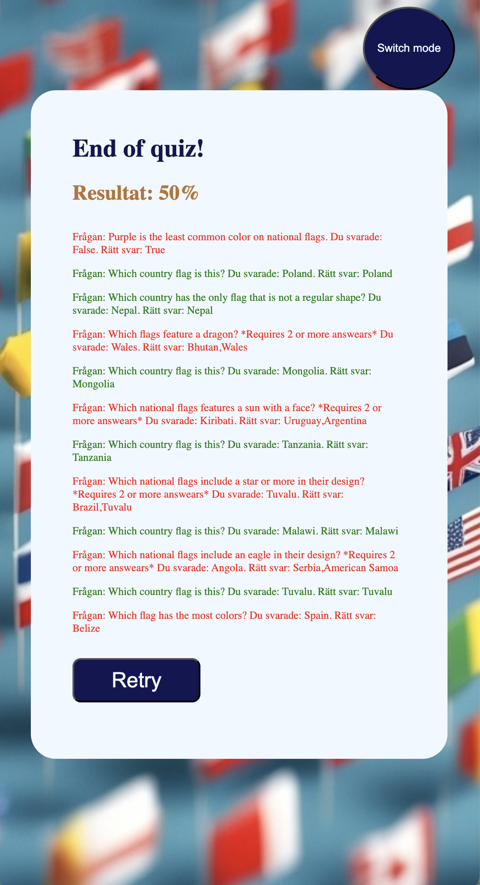

🌍 Flags Quiz – JavaScript Project

📌 Overview

The Flags Quiz is a simple interactive web application built using JavaScript. The goal of the project is to test and improve users’ knowledge of world flags in a fun and engaging way. Players are shown questions about flags and must guess the correct answer from a set of options.

🎯 What It Is

This project is a beginner-friendly quiz game that:
Displays random country flags and flags questions
Challenges users to identify the correct country
Provides feedback on answers at the end
Keeps track of the user’s score
It runs directly in the browser and does not require any installation.

🧠 What I Learned

While building this project, I learned:
How to use JavaScript to manipulate the DOM
Handling user input and events (clicks, selections)
Working with arrays and objects to store quiz data
Using functions to organize and reuse code using OOP programming
Basic game logic and state management
Improving problem-solving skills through debugging

🛠️ Technologies Used

HTML – for structuring the web page
CSS – for styling and layout
JavaScript – for functionality and interactivity

🚀 Features

Multiple choice and single choice answers
Score tracking
Responsive design (works on different screen sizes)
Simple and clean user interface

📷 Demo

📦 How to Run

Clone the repository:
git clone https://github.com/avdrxxa/Flags-quiz.git
Open the project folder
Open index.html in your browser

🔮 Future Improvements

Add difficulty levels
Timer for each question
More countries and flags
Sound effects and animations

🙌 Acknowledgements

Inspiration from online quiz games

📄 License

This project is open source and available under the MIT License.
